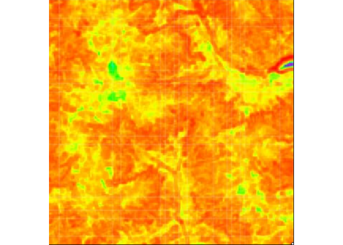
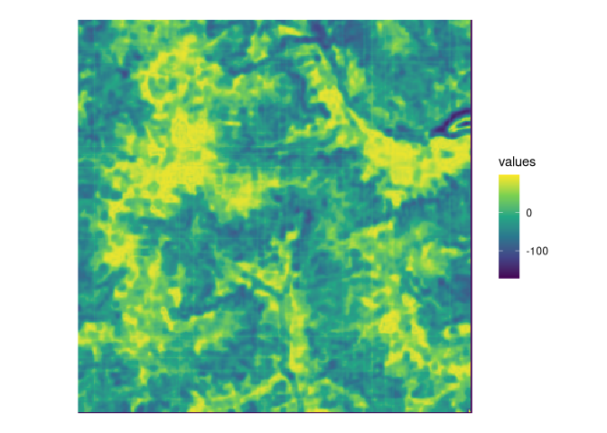

<!-- README.md is generated from README.Rmd. Please edit that file -->

# cblindplot

<!-- badges: start -->

[](https://github.com/ducciorocchini/cblindplot/actions/workflows/main.yaml)
<!-- badges: end -->

**cblindplot** R package is described in Rocchini et al. -
<https://ecoevorxiv.org/9mc7z>.

## Installation

You can install the development version of **cblindplot** from
[GitHub](https://github.com/) with:

``` r
# install.packages("remotes")
remotes::install_github("ducciorocchini/cblindplot")
```

## Example

``` r
library(cblindplot)
my_image <- system.file("pic/imager.png", package = "cblindplot")
```

``` r
my_image_terra <- terra::rast(my_image)
terra::plotRGB(my_image_terra)
```



``` r
cblind.plot(my_image, cvd = "deuteranopia")
```


